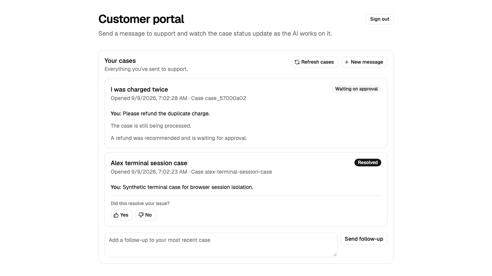

# Synthetic local demo examples

Every identity, message, order, and result below is synthetic. The screenshots are produced by the deterministic Playwright mock-flow test and do not represent an external provider, a paid-model response, or a production transaction.

A synthetic customer signs in as `alex@example.com`, sends “I was charged twice,” and receives a case that is waiting for a human refund decision.

A synthetic approver signs in as `approver@local.test`, reviews the case evidence, and accepts or rejects the exact pending command. The browser test exercises this flow with mock providers and a temporary database.
