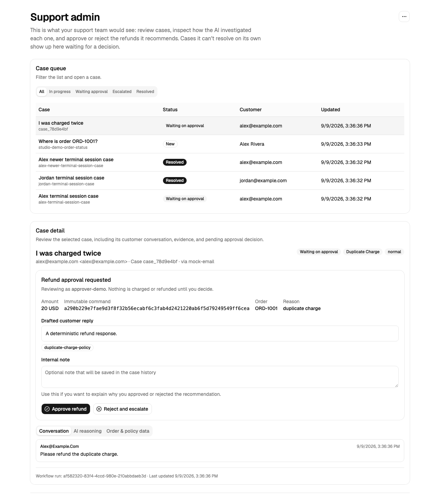

# Synthetic local demo examples

Every identity, message, order, and result below is synthetic. The screenshots are produced by the deterministic Playwright mock-flow test and do not represent an external provider, a paid-model response, or a production transaction.

A synthetic approver opens **Admin dashboard**, chooses **Switch account**, signs in as `approver@local.test`, and accepts or rejects the exact pending command. The browser test exercises this flow with mock providers and a temporary database. The screenshot asset remains at `docs/assets/local-demo-admin.png` until the dedicated refresh run.
